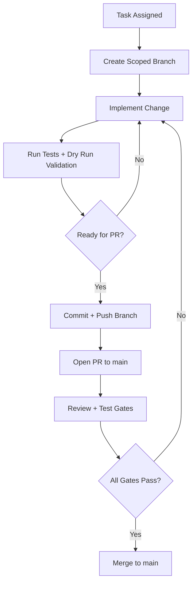
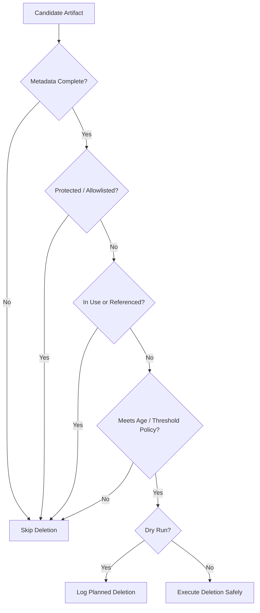
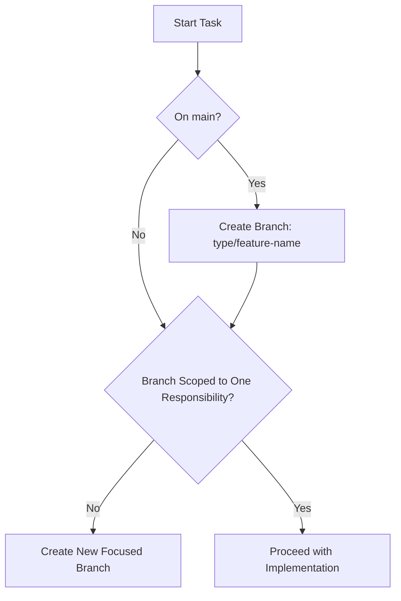
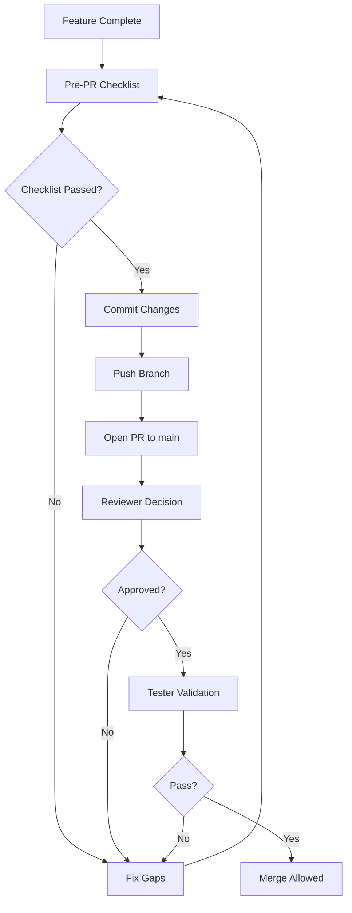
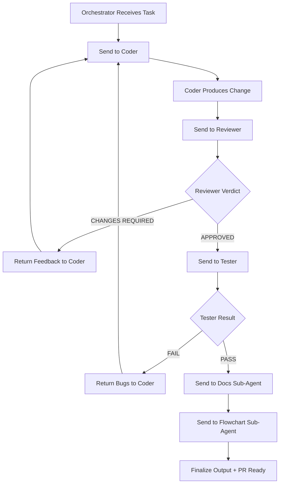
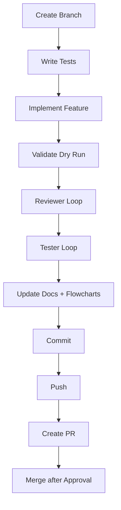

# 🤖 Agent Guidelines – Cleanup Daemon Project

This document defines **mandatory workflows and responsibilities** for all agents contributing to the Cleanup Daemon project.

This project is **safety-critical** (it deletes resources), so stricter rules apply than typical repositories.

---

# 🗺️ Workflow Flowcharts

## Repository Contribution Flow



## Safety Decision Flow (Fail-Closed)



---

# 🌿 Branching Strategy (MANDATORY)

Every new feature, bugfix, backend, or phase MUST be developed in a separate branch.

## 🔀 Branch Creation Rules

Before starting ANY task:

```bash
git checkout -b <type>/<feature-name>
```

## Branch Naming Convention

* `feature/<name>` → new features
* `fix/<name>` → bug fixes
* `refactor/<name>` → code improvements
* `test/<name>` → testing improvements
* `backend/<name>` → backend implementations (Docker, Podman, etc.)
* `policy/<name>` → policy engine changes
* `safety/<name>` → safety-related logic

### Examples

```bash
feature/scheduler-loop
backend/docker-adapter
policy/age-filtering
safety/allowlist-enforcement
fix/disk-usage-parsing
```

## Rules

* ❗ NEVER work directly on `main`
* ❗ One branch = one feature or responsibility
* ❗ Keep branches small and focused
* ❗ Safety-related changes MUST be isolated in their own branches

## Branching Flowchart



---

# 🔁 Pull Request Workflow (MANDATORY)

Once a feature/phase is complete:

## 1. Pre-PR Checklist

Ensure:

* All tests pass ✅
* Reviewer approved ✅
* Code follows conventions ✅
* Dry-run behavior verified (if cleanup logic involved) ✅

---

## 2. Commit Changes

```bash
git add .
git commit -m "feat(scope): short description"
```

### Commit Examples

```bash
feat(policy): add age-based filtering
feat(backend-docker): implement image discovery
fix(executor): handle timeout failures
refactor(state): improve idempotency logic
```

---

## 3. Push Branch

```bash
git push origin <branch-name>
```

---

## 4. Create Pull Request

* Source → your branch
* Target → `main`

## PR Workflow Flowchart



---

# 📋 Pull Request Requirements

Every PR MUST include:

## Title

```
feat(scope): short description
```

## Description

* What was implemented
* Why it was needed
* Safety considerations (MANDATORY for cleanup logic)
* Any trade-offs

---

## Checklist

* [ ] Tests added and passing
* [ ] Dry-run tested (if deletion logic)
* [ ] No unintended deletions possible
* [ ] Detailed code comments added for non-obvious and safety-critical logic
* [ ] All scoped code changes are committed (no uncommitted implementation files)
* [ ] Documentation updated (if behavior changed)
* [ ] Flowcharts updated (if workflow/policy changed)
* [ ] Code reviewed
* [ ] No breaking changes (or documented)

---

# 🔒 Merge Rules

A PR can ONLY be merged if:

* Reviewer → APPROVED
* Tester → PASS
* No merge conflicts
* No uncommitted scoped implementation changes remain
* CI checks pass (if configured)
* Safety validation completed (for cleanup logic)

---

# 🚫 Forbidden Actions

* ❌ Direct commits to `main`
* ❌ Skipping PR process
* ❌ Merging without review
* ❌ Large, unscoped branches
* ❌ Unsafe deletion logic without tests
* ❌ Using destructive commands without dry-run validation
* ❌ Shipping behavior changes without docs/flowchart updates
* ❌ Handing off implementation work without committing scoped code changes

---

# 📁 Documentation Structure (MANDATORY)

The repository MUST maintain dedicated folders:

* `docs/` → narrative documentation, runbooks, architecture, decisions
* `flowcharts/` → standalone Mermaid diagrams for workflow and safety logic

## Structure Rules

* Any behavior change MUST update affected docs in `docs/` or top-level specs
* Any workflow/policy/safety logic change MUST update affected diagrams in `flowcharts/` or embedded Mermaid blocks
* `AGENTS.md` and `requirement.md` remain source-of-truth documents and MUST stay aligned with `docs/` and `flowcharts/`

---

# 💬 Code Commenting Standards (MANDATORY)

All implementation code MUST include detailed and maintainable comments so new contributors can understand intent without reverse-engineering behavior.

## Commenting Rules

* Every module MUST include a short module-level comment describing purpose and safety role
* Every public struct/enum MUST include field or variant comments where intent is not obvious
* Every safety-critical decision path MUST include "why" comments (not only "what")
* Non-obvious algorithms, parsing logic, and edge-case handling MUST be documented inline
* Comments MUST describe assumptions and fail-closed behavior when applicable
* Comments MUST be updated whenever code behavior changes
* Stale or misleading comments are treated as defects

## Comment Quality Requirements

* Comments should be specific, concrete, and implementation-aligned
* Generic comments like "set variable" or "do cleanup" are NOT acceptable
* Safety logic comments MUST clearly state deletion guards and skip conditions
* Public APIs should be understandable by engineers unfamiliar with Rust internals

---

# ⚡ Agent Responsibilities

## 🧑‍💻 Coder Agent

* MUST create branch before coding
* MUST follow TDD (write tests first)
* MUST implement:

  * Safe cleanup logic
  * Fail-closed behavior
* MUST add detailed comments for all non-obvious code and safety-critical paths
* MUST commit after each stable iteration
* MUST NOT hand off code changes without a commit containing the scoped implementation
* MUST validate dry-run before real execution logic

---

## 🔍 Reviewer Agent

* MUST block PR if:

  * Safety logic is incomplete
  * Edge cases are not handled
  * Code violates architecture (policy/backend separation)
* MUST verify:

  * No resource can be deleted if:

    * in use
    * protected
    * recently used
* MUST block PR if comments are missing, stale, or insufficient for understanding safety logic
* MUST block PR if scoped code changes are not committed

---

## 🧪 Tester Agent

* MUST validate:

  * Dry-run vs real-run behavior
  * No deletion of:

    * running containers
    * referenced images
    * attached volumes
* MUST test:

  * failure scenarios
  * unavailable backends
  * partial execution
* MUST block PR if ANY unsafe behavior is detected

---

## 🧭 Orchestrator Agent

* MUST ensure:

  * Proper branch is created
  * PR is opened after completion
  * All agents complete their checks
* MUST enforce:

  * Safety-first development
  * Small iterative delivery
  * Docs and flowchart updates before completion
  * Commit-complete delivery: scoped implementation changes must be committed before final handoff or PR

---

## 📝 Docs Sub-Agent

* MUST maintain and update Markdown documentation
* MUST document safety rationale for behavior changes
* MUST keep `docs/`, `AGENTS.md`, and `requirement.md` consistent
* MUST flag critical documentation gaps as blocking issues

---

## 🗺️ Flowchart Sub-Agent

* MUST maintain Mermaid flowcharts for runtime, safety, and process flows
* MUST update diagrams when workflow or policy logic changes
* MUST include fail-closed and skip-deletion paths in safety diagrams
* MUST flag missing or stale diagrams as blocking issues for safety-critical changes

## Multi-Agent Orchestration Flowchart



---

# 🔁 Full Lifecycle (FINAL FLOW)

1. Create branch
2. Write tests (TDD)
3. Implement feature
4. Validate dry-run behavior
5. Review → fix loop
6. Test → fix loop
7. Update docs and flowcharts
8. Commit changes
9. Push branch
10. Create PR → `main`
11. Merge after approval

## Full Lifecycle Flowchart



---

# 🛡️ Safety Rules (CRITICAL)

This project MUST NEVER:

* Delete active resources
* Delete referenced artifacts
* Delete protected resources
* Perform cleanup without policy validation

If uncertainty exists:

> ❗ MUST skip deletion (fail-closed)

---

# 🧠 Notes

* This is a **production-grade system tool**
* Safety > performance > features
* Small, well-reviewed changes are mandatory
* Clear conventions ensure reliability and prevent critical failures

---
