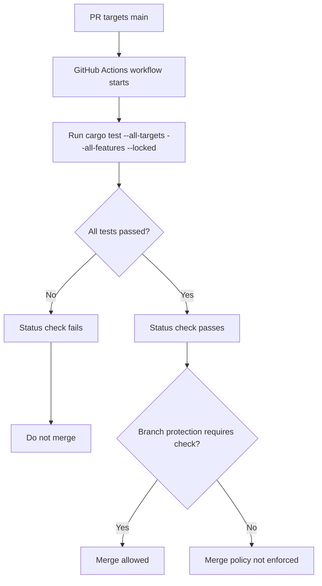
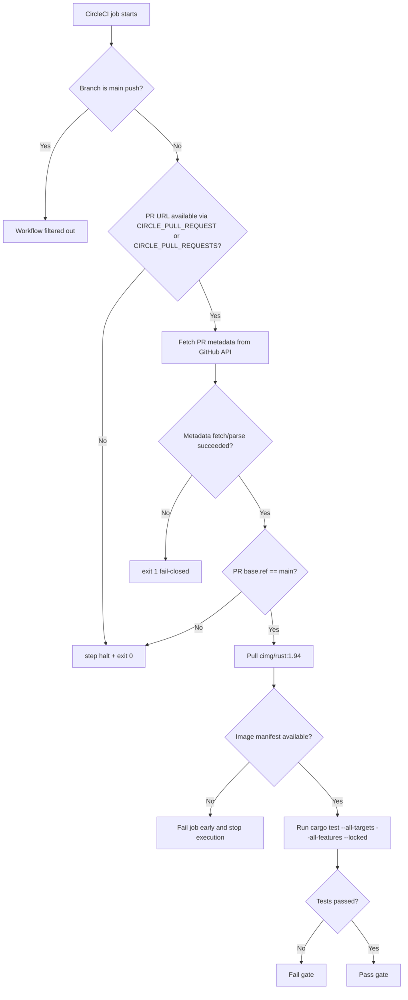

# CI PR Main Gate Flowchart

This diagram captures CI gating for pull requests targeting `main`.

## PR-to-Main Test Gate

Notes:

- The workflow produces the test result signal.
- Branch protection on `main` enforces merge blocking on failed checks.

## CircleCI Image Resolution Guard

Notes:

- Pinning the image tag avoids non-deterministic alias resolution failures.
- If image pull cannot be resolved, the pipeline stops without running partial validation.
- OAuth-safe guard logic scopes execution to pull requests targeting `main`.
- Non-targeted runs halt cleanly, while ambiguous PR metadata fails the job for real PR contexts.
