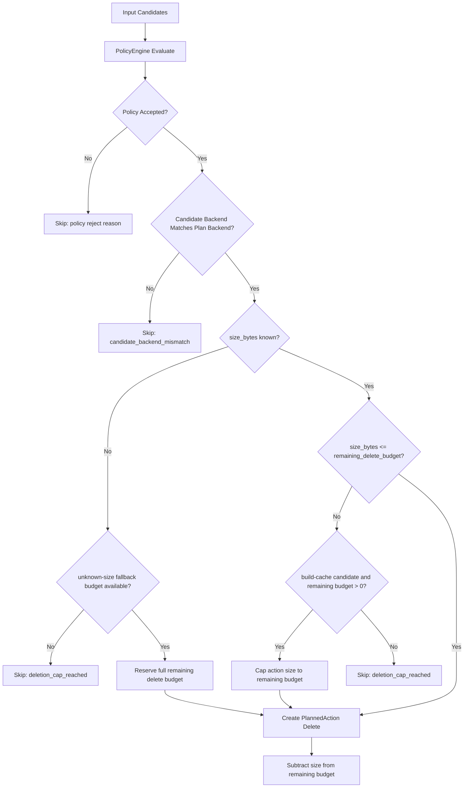
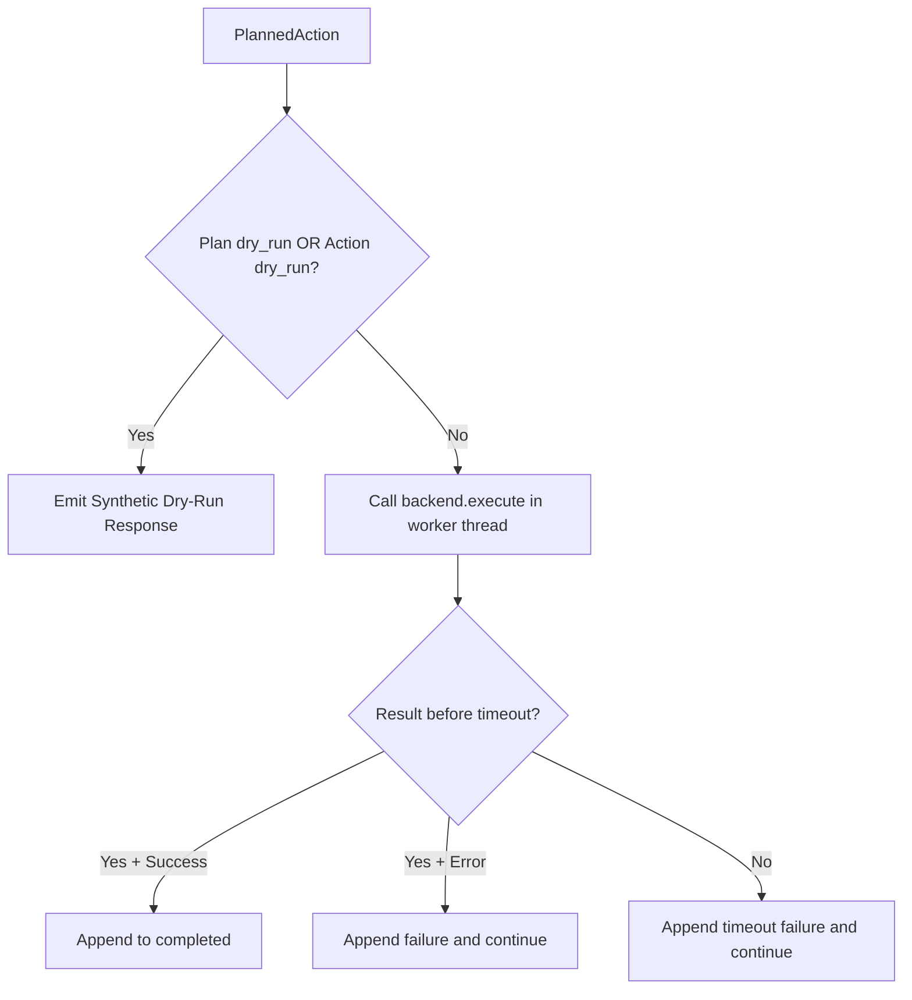
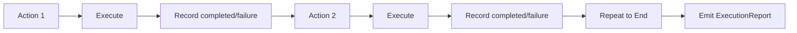

# Cleanup Planning and Execution Flowcharts

This document captures planning and execution safety behavior.

## 1) Planning Gate (Fail-Closed + Delete Cap)

## 2) Execution Gate (Dry-Run + Timeout Wrapper)

## 3) Batch Continuation Behavior

Notes:

- Dry-run paths never invoke backend delete.
- Timeout or backend error for one action never aborts remaining actions.
- Planner and executor both preserve deterministic input order.
