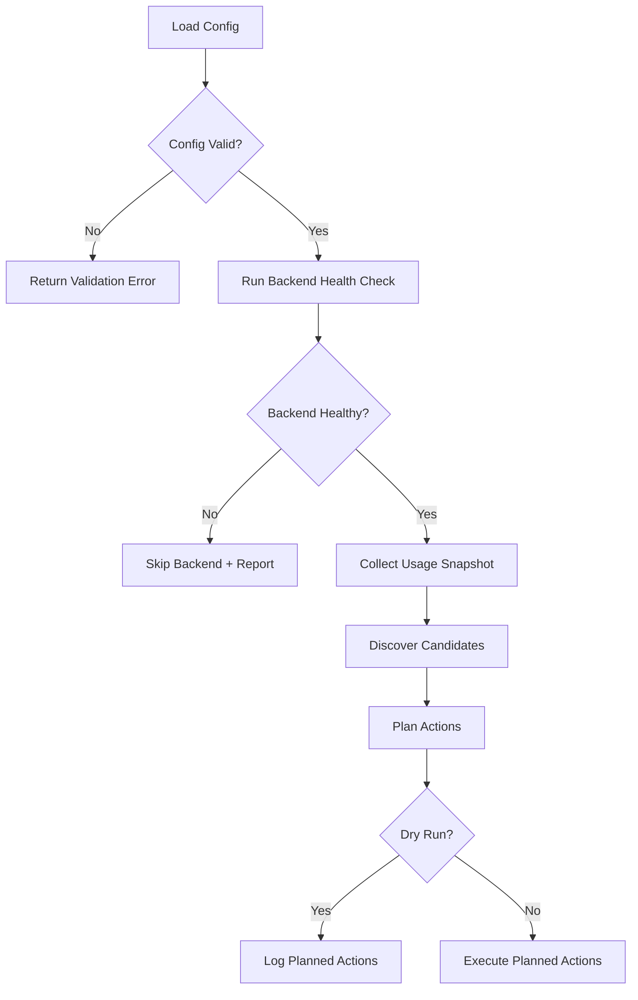
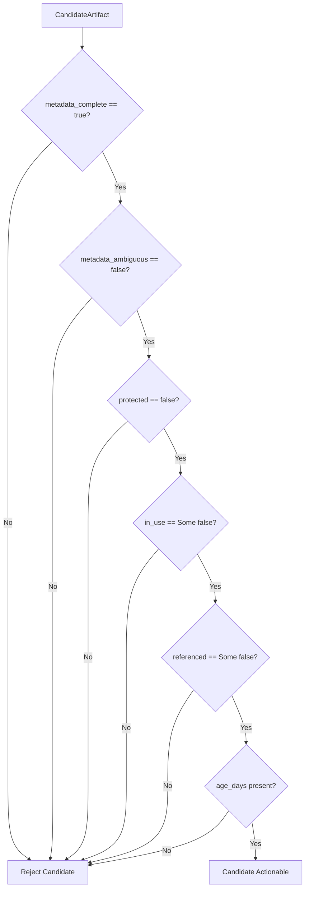
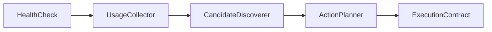

# Core Architecture Flowcharts

This document captures the architecture-level flow. It represents contracts and safety decisions only; runtime cleanup integration is implemented later.

## 1) Data and Control Skeleton

## 2) Candidate Safety Gate (Fail-Closed)

## 3) Backend Interface Contract

