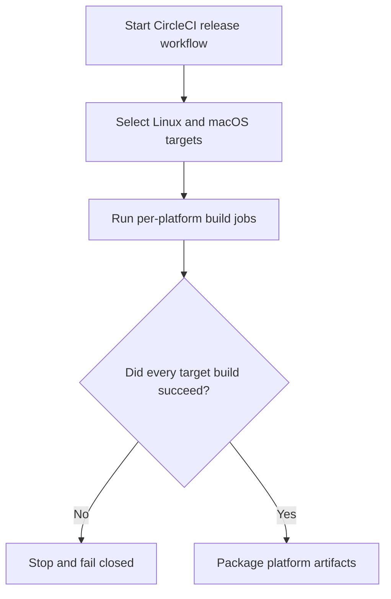
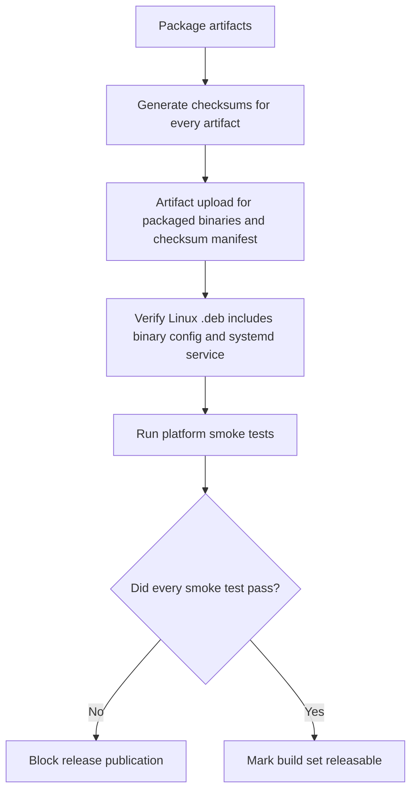
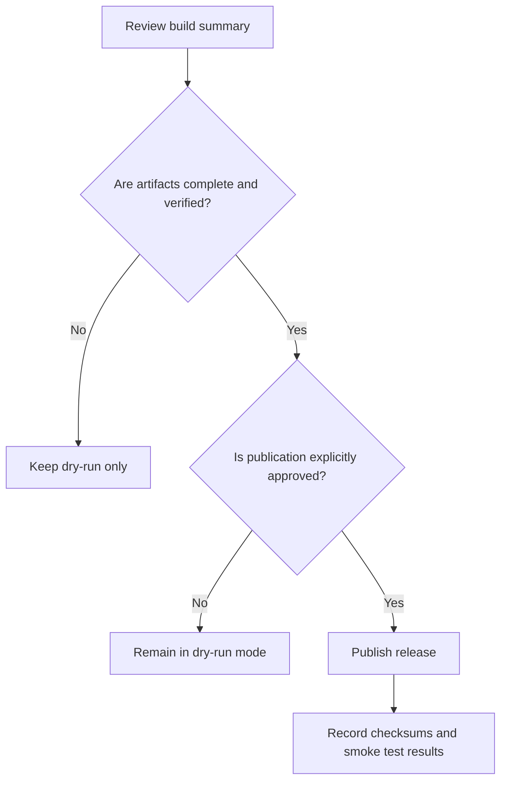

# Cross-Platform Build and Distribution Flowchart

This flowchart captures the CircleCI build matrix, Linux `.deb` packaging, checksum generation, smoke tests, and fail-closed release gate for Linux and macOS.

## Build Matrix Flow

## Integrity and Smoke Test Flow

## Release Gate Flow

## Safety Notes

- Dry-run is the default path until every supported platform has passed build, packaging, checksum, upload, and smoke test steps.
- Any missing target or missing checksum blocks publication.
- Any ambiguity in artifact integrity or smoke-test status must be treated as a release stop, not a warning.
- Fail-closed release gating is required so partial platform coverage cannot be mistaken for a complete distribution.
