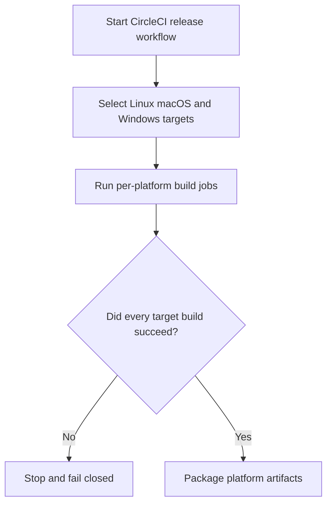
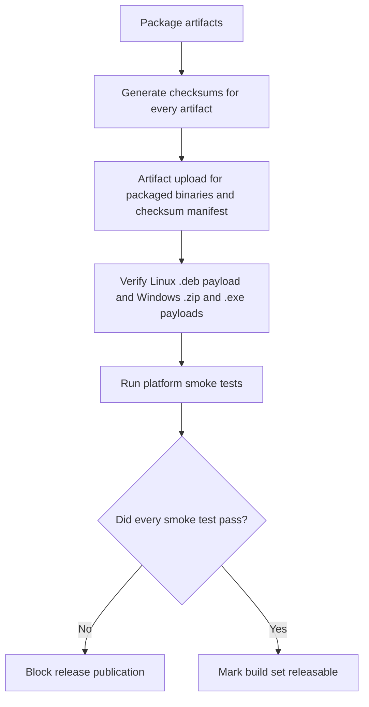
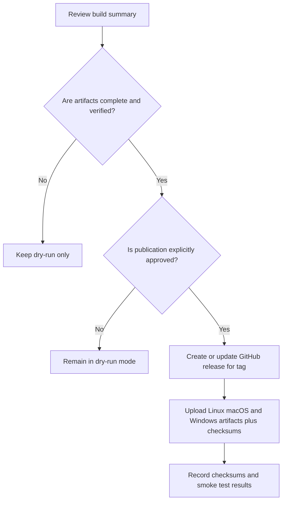

# Cross-Platform Build and Distribution Flowchart

This flowchart captures the CircleCI build matrix, Linux `.deb` packaging, Windows `.zip` plus `.exe` installer packaging, checksum generation, smoke tests, and fail-closed release gate for Linux, macOS, and Windows.

## Build Matrix Flow

## Integrity and Smoke Test Flow

## Release Gate Flow

## Safety Notes

- Dry-run is the default path until every supported platform has passed build, packaging, checksum, upload, and smoke test steps.
- Any missing target or missing checksum blocks publication.
- Linux `.deb` packaging must include only install-time payload files and must not embed the full `target/release` build tree.
- Windows `.zip` and `.exe` installer packaging must include non-empty release binaries and checksum output.
- Windows installer workflow must use classic wizard navigation and explicitly prompt whether to add the install binary path to system PATH.
- Windows packaging must canonicalize installer output paths before verification so ISCC output location and CI checks stay aligned.
- GitHub release publication must run only for version tags and must fail closed when any asset is missing.
- Release publication should use explicit CircleCI project metadata for repository selection instead of depending on local git checkout state.
- Any ambiguity in artifact integrity or smoke-test status must be treated as a release stop, not a warning.
- Fail-closed release gating is required so partial platform coverage cannot be mistaken for a complete distribution.
