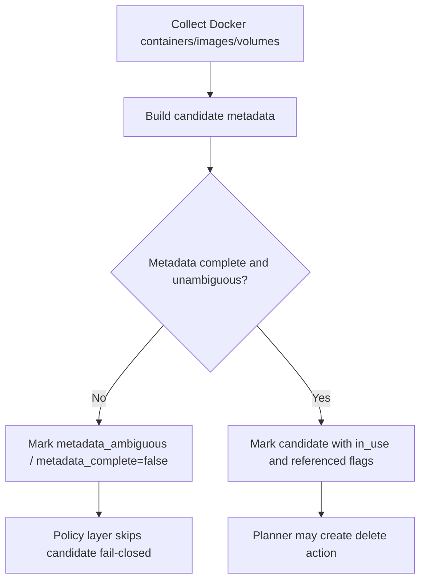
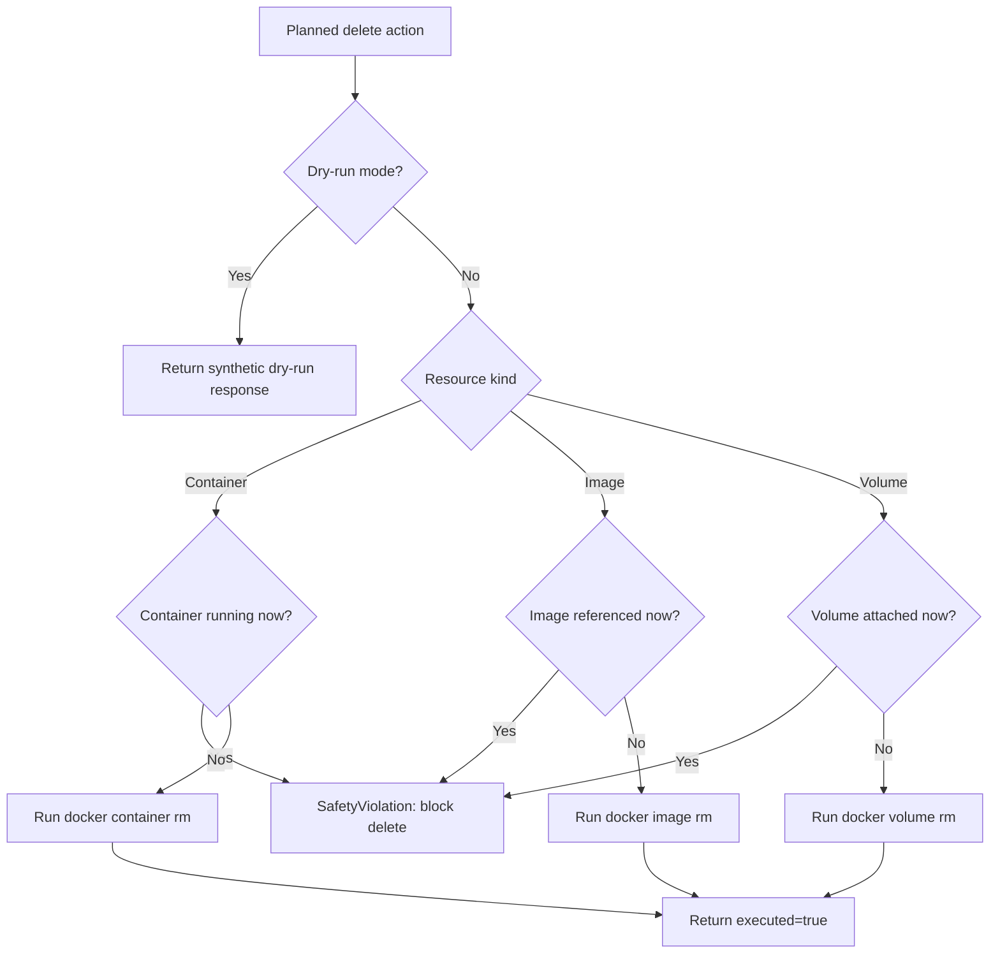

# Docker Backend Flowchart

This document captures Docker adapter control flow and safety guards.

## Discovery Safety Flow

## Execution Safety Re-Validation

Notes:

- Safety checks are re-run immediately before delete to prevent stale-plan unsafe removals.
- Any uncertainty in safety checks stops execution rather than proceeding optimistically.
