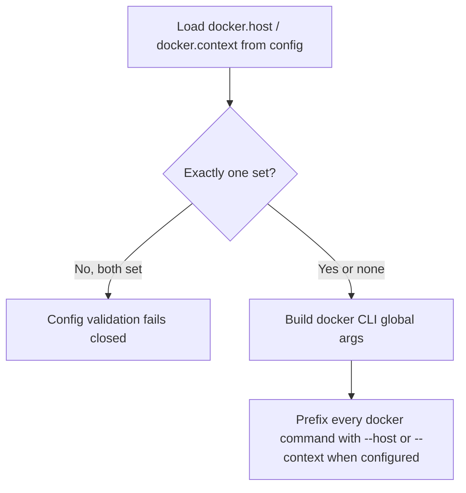
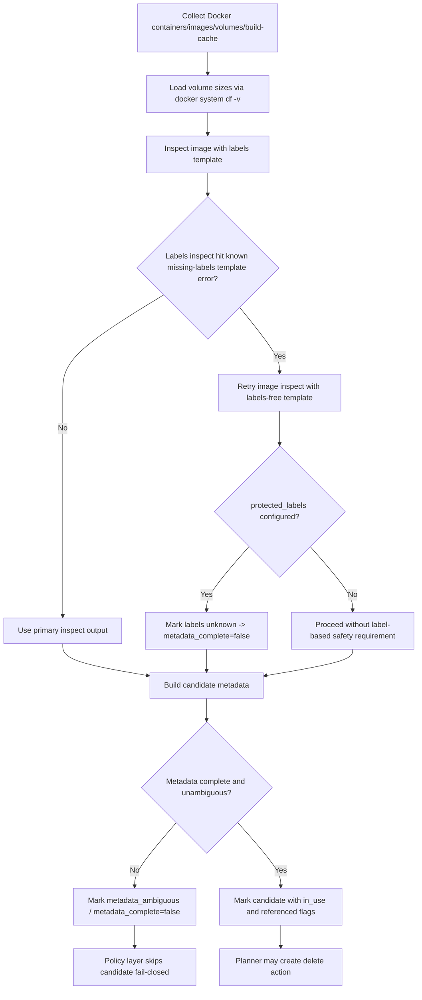
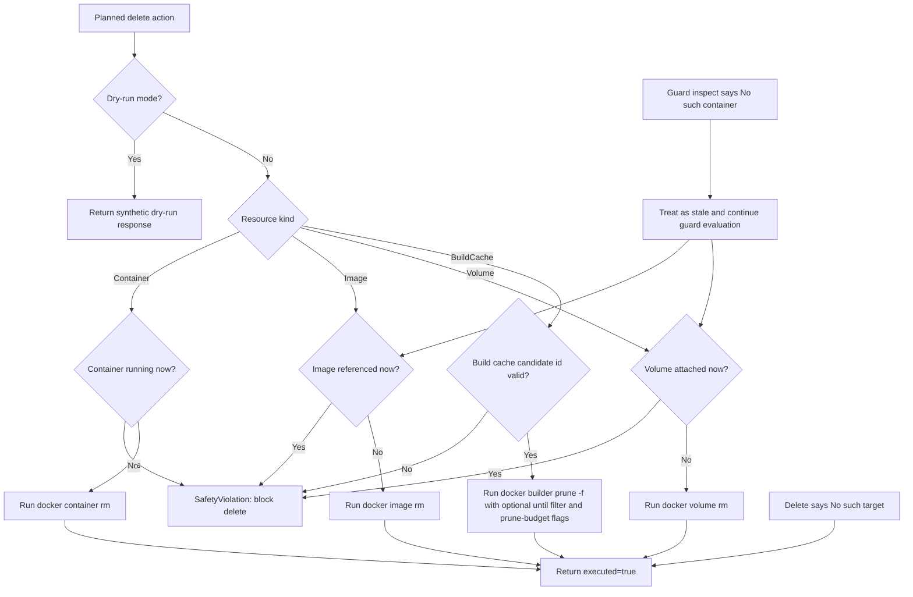

# Docker Backend Flowchart

This document captures Docker adapter control flow and safety guards.

## Command Routing

## Discovery Safety Flow

## Execution Safety Re-Validation

Notes:

- Safety checks are re-run immediately before delete to prevent stale-plan unsafe removals.
- Explicitly missing resources are treated as idempotent no-ops; ambiguous safety metadata still fails closed.
- Image reference guards use `docker ps --format {{.ImageID}}` first, with per-container inspect fallback when that template field is unsupported.
