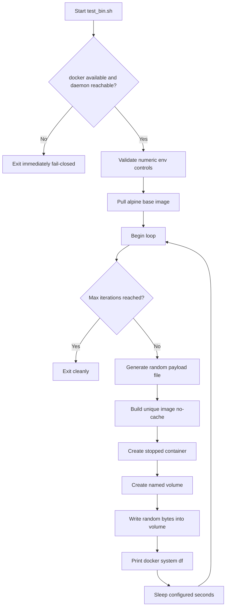

# Docker Storage Growth Helper

This flowchart documents `test_bin.sh`, a local test helper that intentionally grows Docker storage for cleanup validation scenarios.

Safety baseline:

- Abort immediately if Docker is unavailable (fail-closed).
- Default prune-guard daemon behavior remains dry-run by default.

