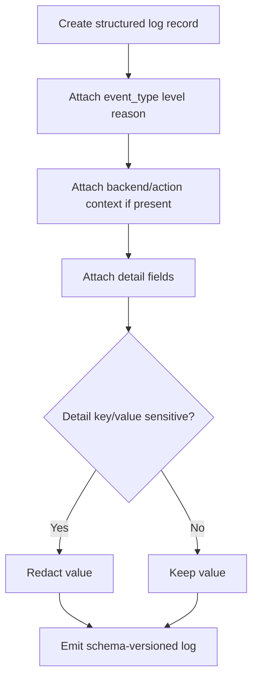
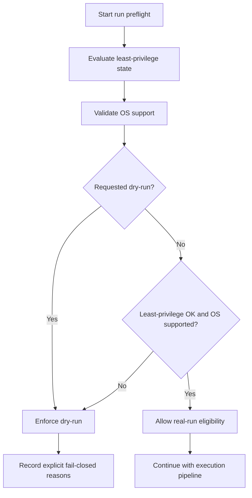
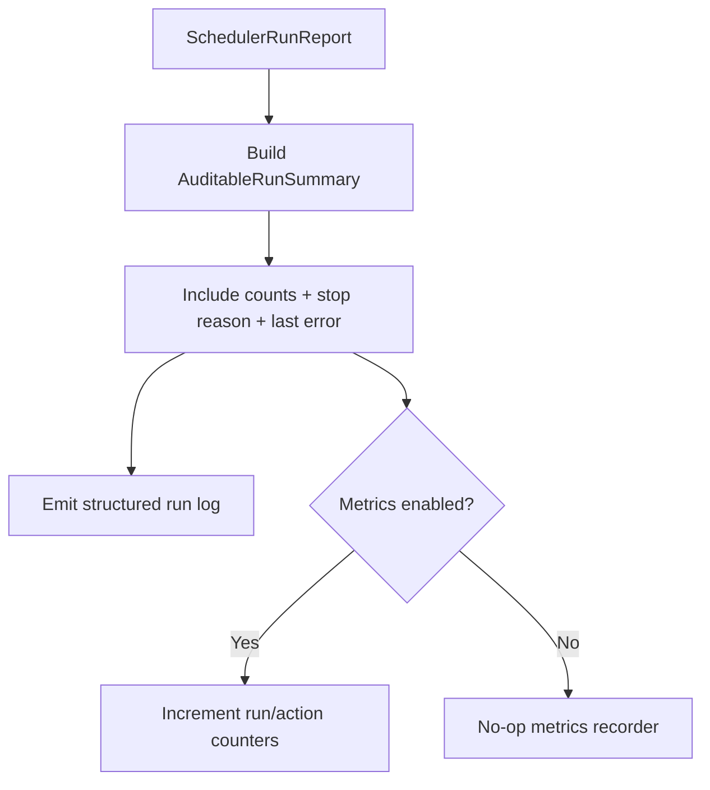

# Observability, Security, and Portability Flowchart

This document captures runtime observability and fail-closed preflight behavior.

## Structured Logging and Redaction Flow

## Runtime Preflight Flow (Security + Portability)

## Per-Run Summary and Metrics Flow

Notes:

- Unsafe privilege or unsupported OS never bypasses into real-run execution.
- Structured logs are schema-versioned and redact sensitive data by default.
- Metrics are optional and non-blocking; observability remains available without metrics backends.
