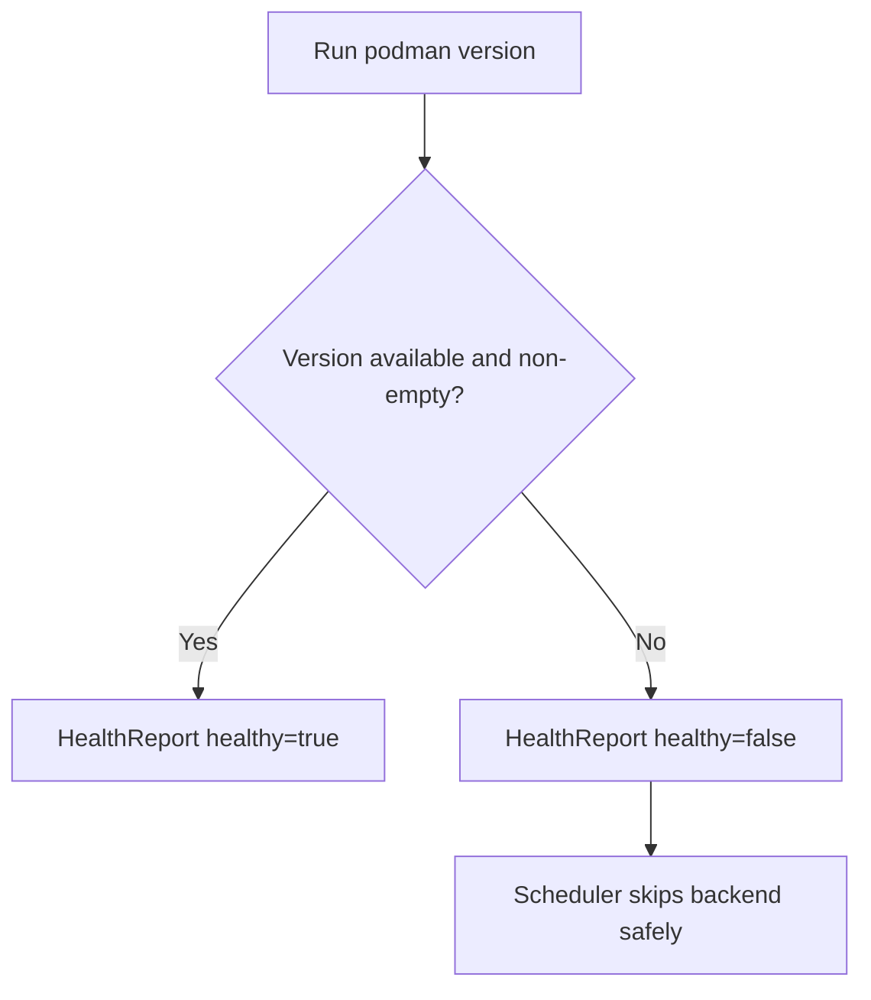
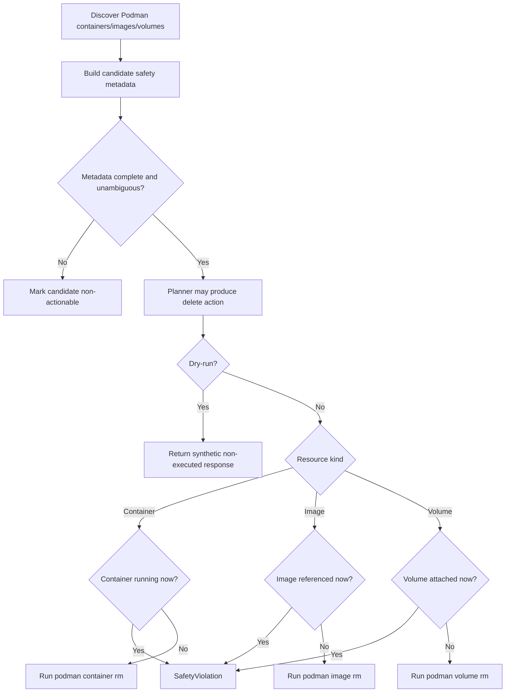

# Phase 6 Podman Backend Flowchart

This document captures Podman adapter parity flow and graceful degradation behavior.

## Health and Degradation Flow

## Discovery and Execution Safety Flow

Notes:

- Podman unavailability degrades to unhealthy backend status instead of crashing the run.
- Safety checks are repeated before deletion to maintain fail-closed behavior under changing runtime state.
