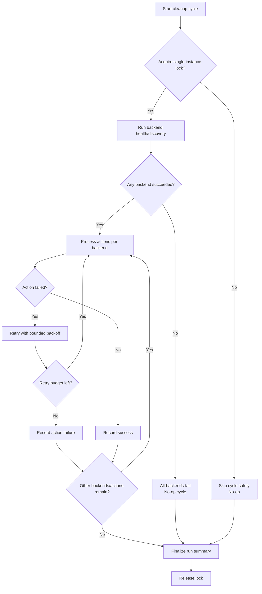
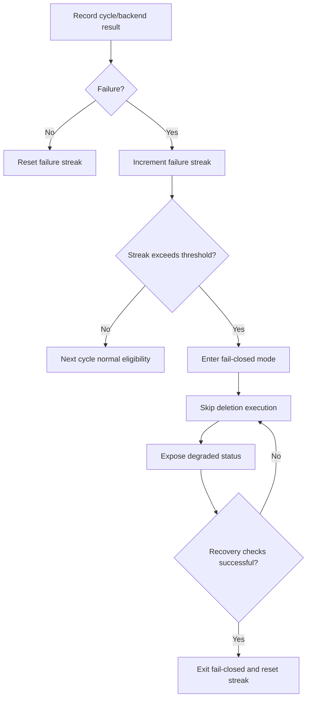

# Phase 7 Reliability and Error Handling Flowchart

This document captures retry, continuation, locking, and fail-closed reliability behavior.

## Cycle Reliability Flow

## Repeated-Failure Fail-Closed Flow

Notes:

- Lock contention and all-backend failure both end in safe no-op outcomes.
- Retry exhaustion never bypasses safety checks or converts failure into success.
- Fail-closed mode blocks destructive actions until explicit recovery conditions pass.

