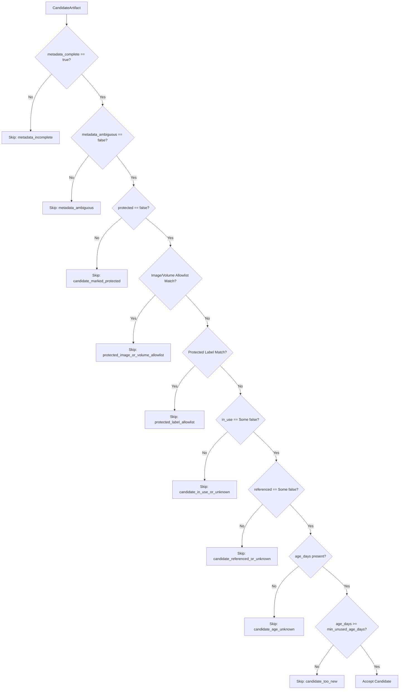
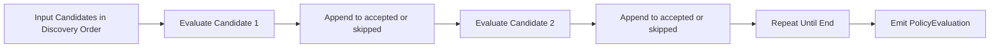

# Policy Engine Flowcharts

This document captures the candidate policy gate and deterministic decision order used by `PolicyEngine`.

## 1) Candidate Selection Gate (Fail-Closed)

## 2) Batch Evaluation Determinism

Notes:
- Accepted and skipped lists preserve original input order.
- Exactly one reject reason is emitted per skipped candidate.
