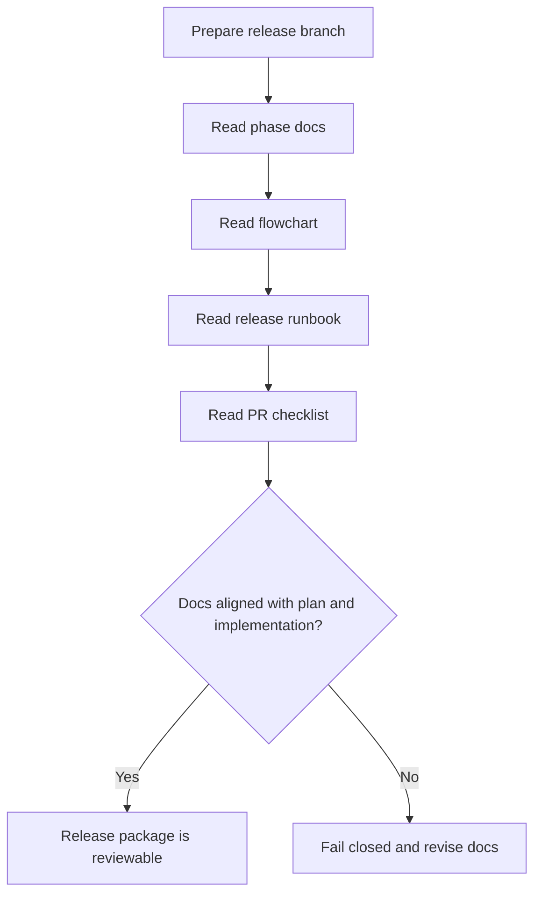
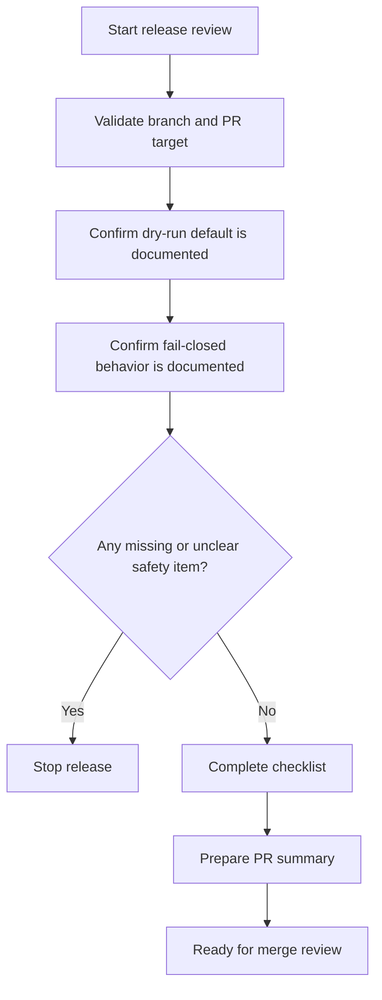
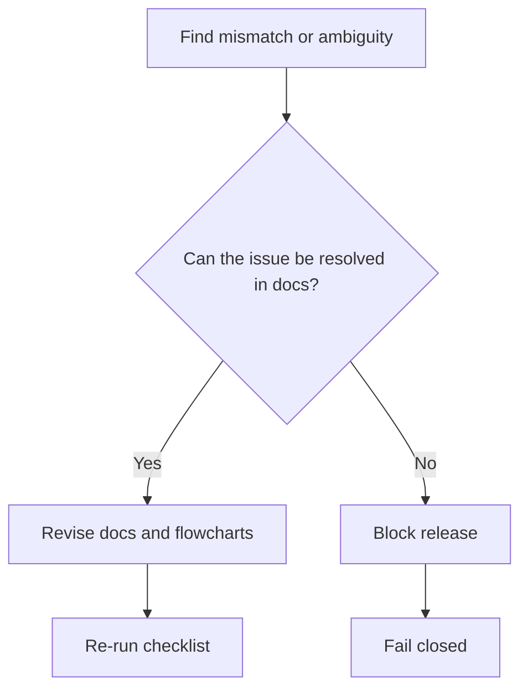

# Release Readiness Flowchart

This document captures the documentation alignment and release-readiness path.

## Docs Alignment Flow

## Runbook and Checklist Flow

## Abort Path

Notes:

- Release readiness is not complete until docs, flowcharts, and checklist agree on the same safety model.
- Dry-run remains the documented default unless an explicit real-execution step says otherwise.
- Any unresolved ambiguity blocks the release rather than being interpreted optimistically.
