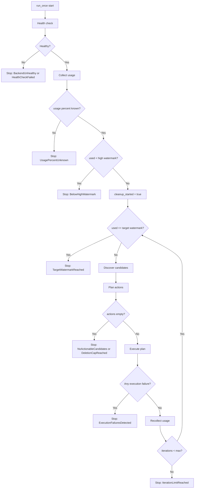
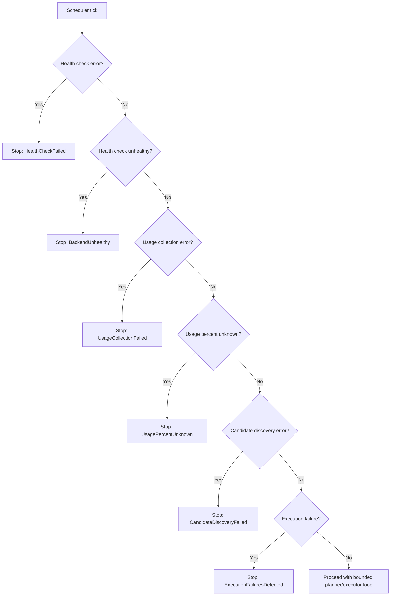

# Scheduler + Watermark Loop Flowcharts

This document captures scheduler start/stop behavior and fail-closed exit paths.

## 1) Watermark Loop Start and Stop

## 2) Fail-Closed Exit Paths

Notes:

- Every unsafe or uncertain branch exits the current cycle immediately.
- No exit path forces deletion when required safety signals are missing.
