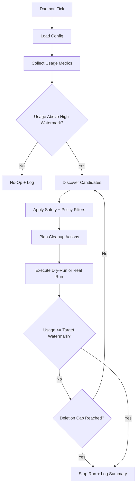
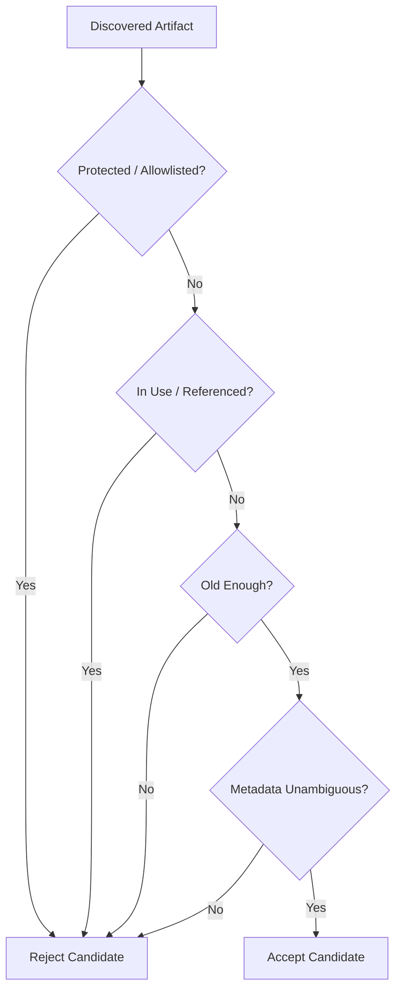
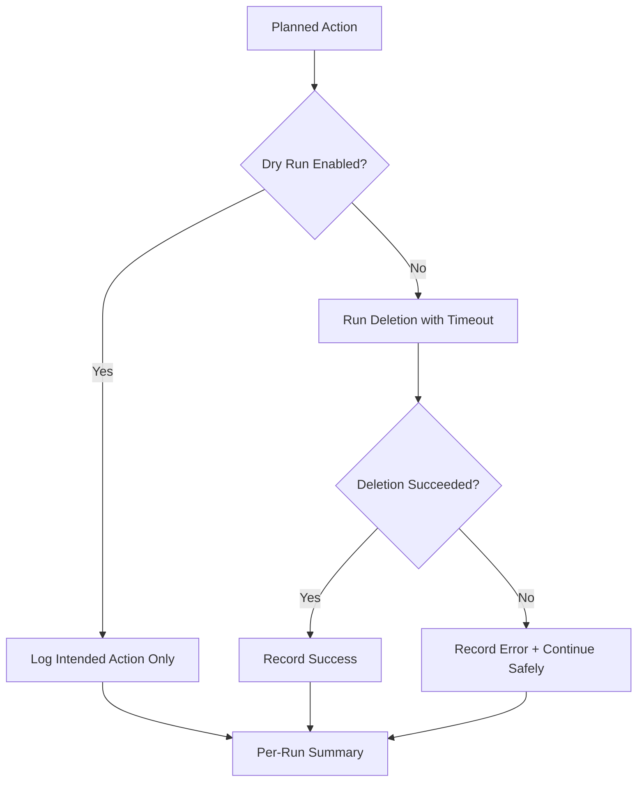
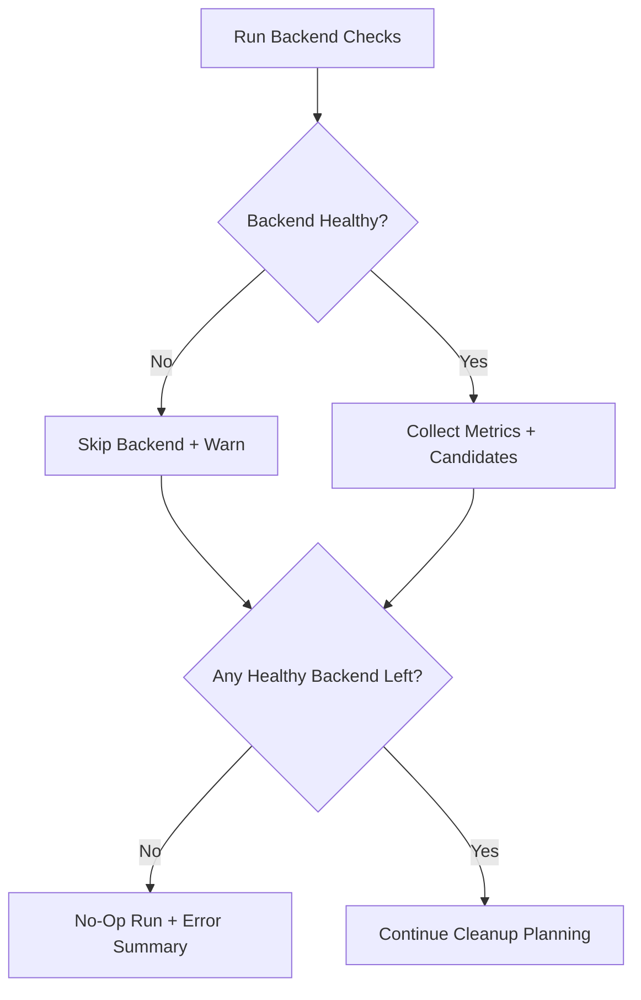
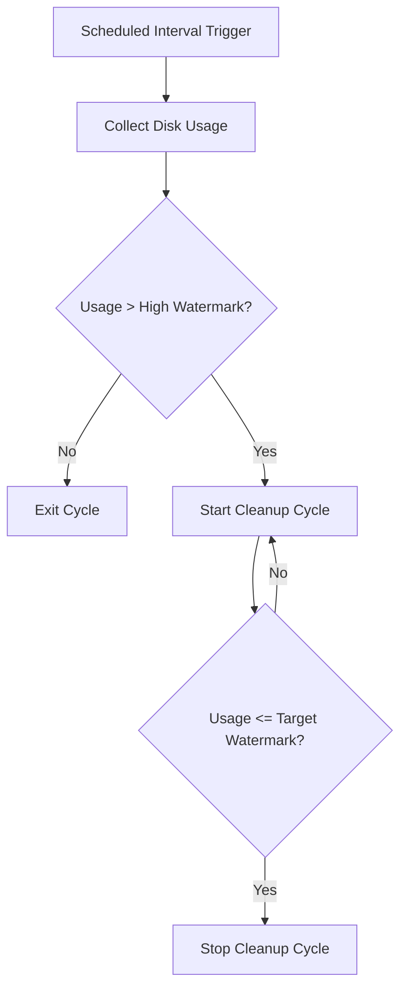
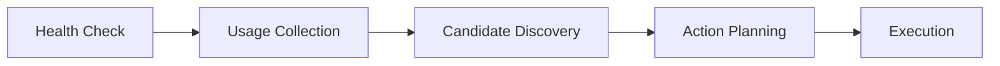
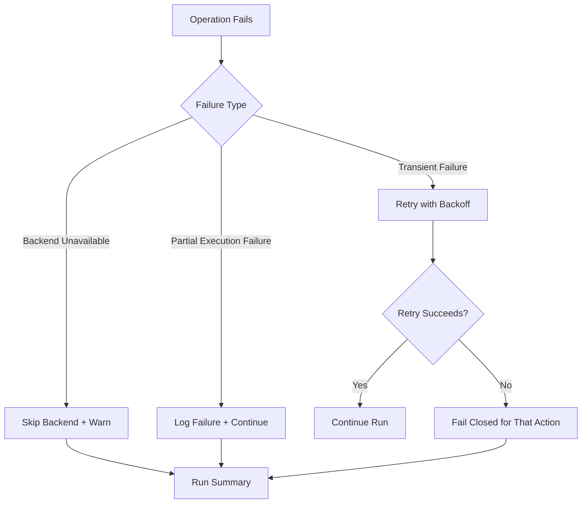
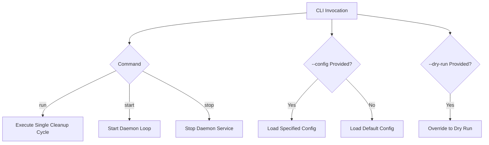

# Cleanup Daemon – Requirements Specification

## 1. Overview

The Cleanup Daemon is a lightweight, policy-driven background service written in Rust.
Its purpose is to safely reclaim disk space by removing unused and stale artifacts (e.g., containers, images, volumes) across multiple backends such as Docker and Podman.

---

## 1.1 System Flowcharts

### End-to-End Runtime Flow

### Artifact Selection Flow

### Execution Safety Flow

### Backend Failure Handling Flow

---

## 2. Goals

* Automatically manage disk usage
* Prevent storage exhaustion
* Ensure safe cleanup without deleting important data
* Provide a pluggable architecture for multiple backends
* Be production-ready and cross-platform

---

## 3. Functional Requirements

### 3.1 Core Behavior

* The daemon MUST run periodically based on a configurable interval
* The daemon MUST collect disk usage metrics before taking action
* Cleanup MUST only trigger when usage exceeds a configured threshold
* Cleanup MUST stop when usage reaches a safe target threshold

#### Core Behavior Flowchart

### 3.2 Artifact Selection

* The system MUST identify unused artifacts (images, containers, volumes)
* The system MUST verify that artifacts are not actively referenced
* The system MUST filter artifacts based on age
* The system MUST exclude protected artifacts

### 3.3 Cleanup Execution

* The system MUST support dry-run mode (no actual deletion)
* The system MUST execute cleanup actions safely with timeouts
* The system MUST limit deletion per run (configurable cap)
* The system MUST log all actions and decisions

### 3.4 Backend Support

* The system MUST support pluggable backends
* Each backend MUST implement a standard interface:

  * Health check
  * Usage collection
  * Candidate discovery
  * Action planning
  * Execution

#### Backend Interface Flowchart

### 3.5 Configuration

* The system MUST support configuration via TOML file
* The system MUST allow enabling/disabling backends
* The system MUST allow defining safety rules (allowlist, labels)

---

## 4. Non-Functional Requirements

### 4.1 Performance

* The daemon MUST have low CPU and memory overhead
* The daemon MUST avoid blocking system resources

### 4.2 Reliability

* The system MUST be crash-safe
* The system MUST be restart-safe
* The system MUST support single-instance execution (locking)

### 4.3 Safety

* The system MUST never delete:

  * Running containers
  * Referenced images
  * Attached volumes
* The system MUST fail safely (skip deletion on uncertainty)

### 4.4 Observability

* The system MUST provide structured logs
* The system SHOULD provide metrics (optional)
* The system MUST generate per-run summaries

### 4.5 Portability

* The system MUST support:

  * Linux
  * macOS
  * Windows

---

## 5. Safety Requirements

* The system MUST support allowlists for:

  * Images
  * Volumes
  * Labels
* The system MUST support dry-run mode by default
* The system MUST enforce deletion limits per run
* The system MUST skip artifacts with ambiguous metadata

---

## 6. Configuration Requirements

Example parameters:

* `interval_secs`
* `high_watermark_percent`
* `target_watermark_percent`
* `min_unused_age_days`
* `max_delete_per_run_gb`
* `dry_run`
* `protected_images`
* `protected_volumes`
* `protected_labels`

---

## 7. Backend Requirements

Each backend MUST:

* Declare supported operating systems
* Detect feature support dynamically
* Handle failures gracefully
* Avoid unsafe direct file system operations

---

## 8. Error Handling

* If a backend is unavailable → skip and log warning
* If all backends fail → no-op run
* The system MUST implement retry with backoff
* The system MUST not crash on partial failures

### Error Handling Flowchart

---

## 9. Security Requirements

* The system MUST follow least-privilege execution
* The system MUST avoid shell injection risks
* The system MUST redact sensitive data in logs
* The system MUST restrict writable paths

---

## 10. CLI Requirements

The system SHOULD provide:

* `run` → execute once
* `start` → run as daemon
* `stop` → stop daemon
* `--config` → specify config file
* `--dry-run` → override config

### CLI Command Flowchart

---

## 11. Deployment Requirements

* Linux: systemd service + timer
* macOS: launchd
* Windows: Task Scheduler

---

## 12. Future Requirements

* Support additional backends (containerd, Kubernetes)
* Add metrics integration (Prometheus)
* Provide alerting hooks
* Add policy plugins

---

## 13. Acceptance Criteria

The system is considered complete when:

* It safely cleans unused artifacts without data loss
* It runs reliably across supported platforms
* It supports at least Docker backend
* It passes unit and integration tests
* It provides clear logs and configuration

---
